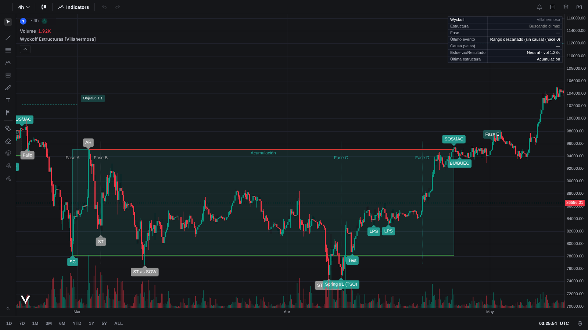
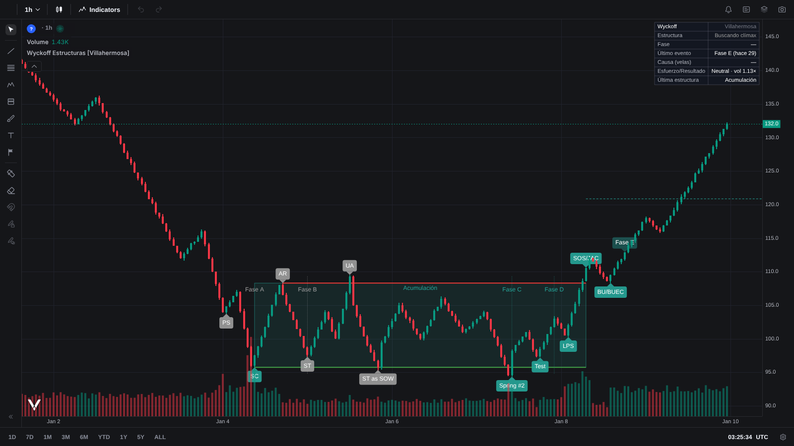
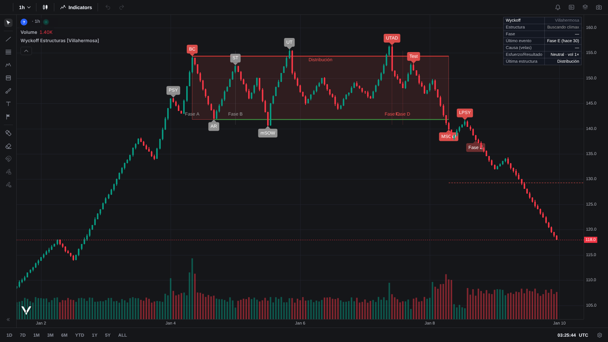
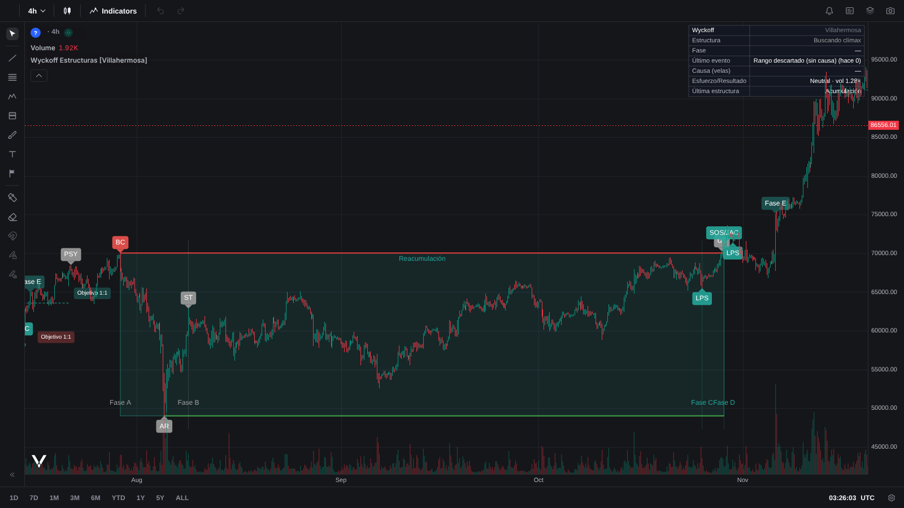

# Wyckoff Estructuras [Villahermosa]

Indicador en **Pine Script v6** que detecta y etiqueta estructuras Wyckoff según *La Metodología Wyckoff en profundidad* (Rubén Villahermosa). Corre igual en **TradingView** y en **Vela** de LuxAlgo, a través de **PineTS** (`@luxalgo/vela-pinets`).



Detecta los cuatro tipos de rango del libro:

| Empieza tras… | Sale… | Tipo |
|---|---|---|
| una caída (SC) | al alza | **Acumulación** |
| una caída (SC) | a la baja | **Redistribución** |
| una subida (BC) | a la baja | **Distribución** |
| una subida (BC) | al alza | **Reacumulación** |

Para cada rango dibuja:

- la caja del rango;
- la resistencia (Creek) en rojo y el soporte (ICE) en verde, como en los esquemas del libro;
- los separadores de **Fase A–E**;
- los eventos, con un *tooltip* que explica cada uno;
- el objetivo por **causa y efecto**: la altura del rango proyectada desde la ruptura;
- una tabla de estado: estructura, fase, último evento, duración de la causa y lectura **esfuerzo/resultado** de la vela actual.

## Uso

### TradingView
1. Abrí el Pine Editor y pegá [`wyckoff-estructuras.pine`](wyckoff-estructuras.pine).
2. Hacé clic en *Add to chart*.
3. Las alertas disponibles son: Spring, UTAD, Test de Fase C, SOS/JAC, MSOW y Fase E.

### Vela + PineTS (demo local)
```bash
cd indicadores/wyckoff
npm install
npm run demo          # abre la demo con Vite
```
| URL | Qué muestra |
|---|---|
| `/` | BTCUSDT 4h en vivo (Binance) |
| `/?symbol=ETHUSDT&tf=60` | otro par o temporalidad |
| `/?datos=acumulacion1` | esquemas sintéticos del libro: `acumulacion1`, `distribucion1`, `acumulacion2` |
| `/?json=/velas.json&tf=240&desde=2025-02-01&hasta=2025-05-15` | tus velas `[{time, open, high, low, close, volume}]` |

El script se carga en Vela con `PineWorkerEngine`, que lo ejecuta en un Web Worker:

```js
new VelaWorkspace('#chart', {
  layout: false, symbol: 'BTCUSDT', timeframe: '240',
  providers: {binance: () => new BinanceProvider()},
  engines: {pine: () => new PineWorkerEngine()},
  indicators: [{name: 'Wyckoff Estructuras', enabled: true, script}],
});
```

### GitHub Pages
La demo publicada vive en `/docs` (raíz del repo): <https://camilolwi-oss.github.io/videos-trading/>. Para regenerarla después de cambiar el script:
```bash
npm run build:pages   # compila demo/ en ../../docs con rutas relativas
```
Pages se sirve con *Deploy from a branch*, carpeta `/docs`.

### Pruebas (PineTS en Node)
```bash
npm test
```
Ejecuta el script con PineTS sobre velas sintéticas que reproducen los esquemas del libro (`test/escenarios.mjs`). Verifica que los eventos salgan en el orden esperado:

- **Acumulación #1**: PS → SC → AR → ST → UA → ST as SOW → Spring → Test → SOS/JAC → BU/BUEC → Fase E.
- **Distribución #1**: PSY → BC → AR → ST → mSOW → UT → UTAD → Test → MSOW → LPSY → Fase E.
- **Acumulación #2** (sin Spring): … → LPS → SOS/JAC → BU/BUEC → Fase E.
- **Tendencia limpia**: no debe detectar ninguna estructura.

## Del libro a las reglas

Los esquemas del libro son ideales y la detección automática necesita reglas concretas. Cada regla busca respetar la *función* que el autor le da al evento (`.claude/skills/villahermosa-wyckoff/` tiene el detalle de cada capítulo).

| Evento | Regla del indicador | Libro |
|---|---|---|
| **SC / BC** | Nuevo mínimo (máximo) de `trendLen` velas, tras un recorrido ≥ `trendATR` ATR, con volumen ≥ `climaxMult` × la media. Opción para aceptar un clímax por agotamiento (*Selling Exhaustion*) | Ch8 |
| **PS / PSY** | Último pivote con volumen alto (≥ `psMult`) en la tendencia, antes del clímax | Ch8 |
| **AR** | Primer pivote opuesto que se aleja ≥ `minRangeATR` ATR del clímax. Fija el otro extremo del rango | Ch8 |
| **ST** | Pivote que vuelve a la zona del clímax (35 % del rango) **con menos volumen** que el clímax. Cierra la Fase A | Ch2, Ch8 |
| **UA / UT**, **ST as SOW / mSOW** | Sacudidas (salen del rango y vuelven a cerrar dentro) mientras la Fase B es joven: menos de `minBBars` velas y menos de `bRel` × la duración de la Fase A | Ch2 |
| **Spring / UTAD** | La primera sacudida con la Fase B madura abre la **Fase C** y fija el sesgo | Ch2, Ch9 |
| Tipos de Spring | **#1/TSO**: penetración ≥ `tsoPen` ATR y volumen ≥ `tsoVol`. **#3**: volumen < `sp3Vol` (oferta agotada, no exige test). **#2**: el resto | Ch9 |
| **Test** | Pivote posterior que respeta el extremo del Spring/UTAD, con menos volumen y en la mitad del rango cercana al extremo | Ch9 |
| **LPS / LPSY** | Mínimos crecientes (máximos decrecientes) tras el test. En el **esquema #2** (ruptura sin sacudida) el último pivote del rango se etiqueta como LPS/LPSY de la Fase C | Ch2 |
| **Fase D** | El precio cruza la mitad del rango a favor del sesgo | Ch2 |
| **SOS/JAC / MSOW** | `confirmBars` cierres consecutivos fuera del rango a favor del sesgo | Ch2, Ch5 |
| **BU/BUEC / LPSY** | Primer pivote de retroceso tras la ruptura (cerca del Creek/ICE) | Ch2 |
| **Fase E** | Supera el extremo posterior a la ruptura después del BU, o recorre una altura de rango sin retroceso | Ch2 |
| Objetivo | Altura del rango proyectada desde la ruptura (proyección vertical 1:1) | Ch4 |

**Reinterpretaciones.** El libro insiste en que cada evento es *potencial* hasta que lo confirman los siguientes, así que el indicador corrige su lectura:

- Una ruptura **sin sacudida previa** que vuelve al rango en ≤ `reinterBars` velas era una **falsa rotura**: pasa a ser **UTAD** o **Spring**. Es divergencia esfuerzo/resultado en un nivel clave (Ch5).
- Tras un Spring (UTAD), si el precio acepta del otro lado del rango, aquella sacudida era un **ST as SOW** (**UA/UT**) de la Fase B. La estructura cambia de tipo; por ejemplo, de acumulación a redistribución. Es la confusión que el autor señala como la más difícil del método (Ch6, Ch7).
- Si el rango se rompe antes de madurar la Fase B, se descarta como *rango sin causa*, porque no todos los rangos tienen interés profesional. Si la estructura falla después de la Fase C, se mantiene marcada como **fallida**.

**Sin repintado.** Los eventos que dependen de pivotes se confirman `pivRight` velas después y se dibujan en la vela del pivote. Las reinterpretaciones borran y rehacen etiquetas de la estructura en curso, igual que haría un analista.

**Sin volumen** (algunos índices o CFD): el esfuerzo se aproxima con el rango relativo de la vela.

## Capturas

| | |
|---|---|
|  |  |
| Acumulación #1 sintética | Distribución #1 sintética |
|  |  |
| BTC 4h feb–abr 2025: Spring #1 (TSO) en la caída del 7 de abril | BTC 4h ago–oct 2024: reacumulación y salida en noviembre |

Las capturas de BTC usan velas reales de Binance (BTCUSDC) que PineTS incluye en sus pruebas de compatibilidad.

## Límites
- Es una lectura **mecánica** de un método discrecional. El autor insiste en que el mercado nunca repite dos estructuras iguales: usalo como mapa, no como señal automática.
- Los umbrales (ATR, × volumen, duraciones) son una interpretación cuantitativa, no reglas del libro. Ajustalos por activo y temporalidad.
- Solo hay una estructura activa a la vez. Mientras un rango está vivo no se buscan estructuras menores dentro de él; para eso, bajá de temporalidad.

## Licencias
- Script: MPL-2.0 (encabezado estándar de TradingView; cambialo si preferís otra licencia).
- [Vela](https://github.com/LuxAlgo/vela): Apache-2.0. [vela-pinets](https://github.com/LuxAlgo/vela-pinets) y [PineTS](https://github.com/LuxAlgo/PineTS): **AGPL-3.0**. Si distribuís la demo como producto cerrado, LuxAlgo ofrece licencia comercial.
- El contenido del libro en la skill está parafraseado (© Rubén Villahermosa).
